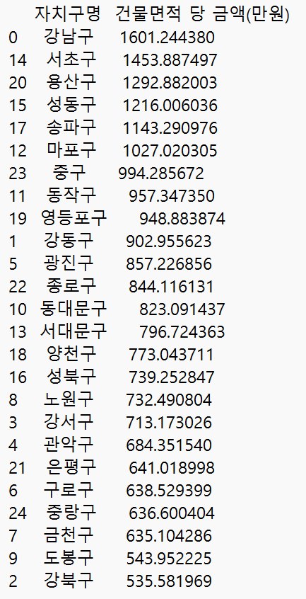
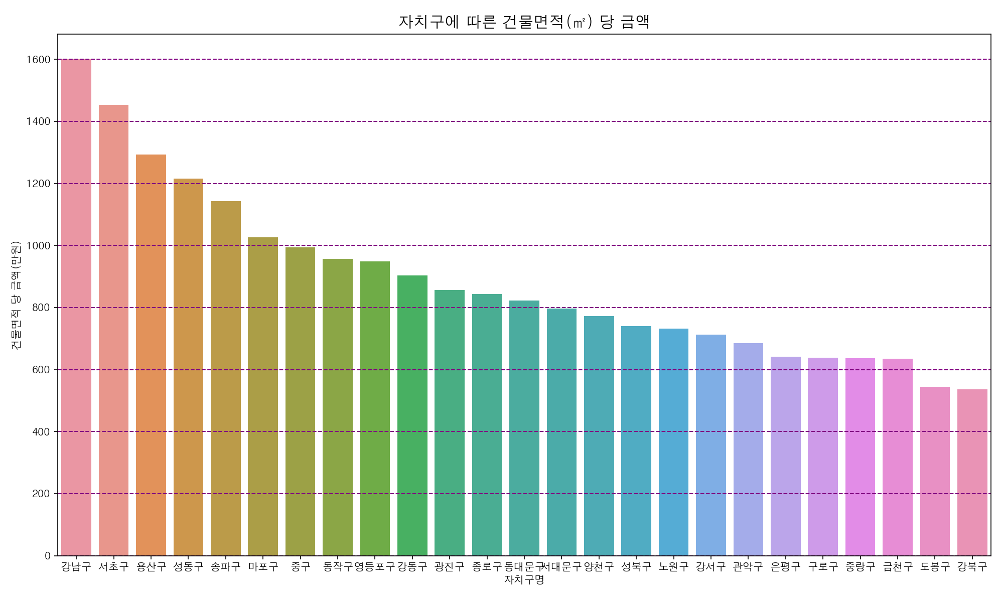
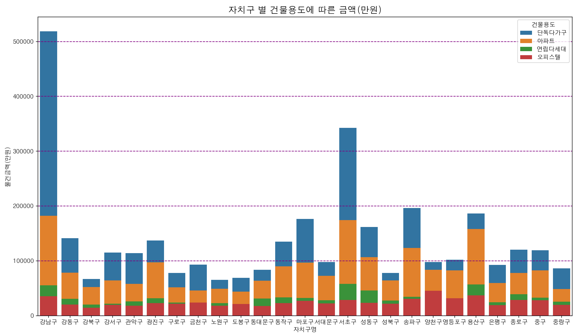
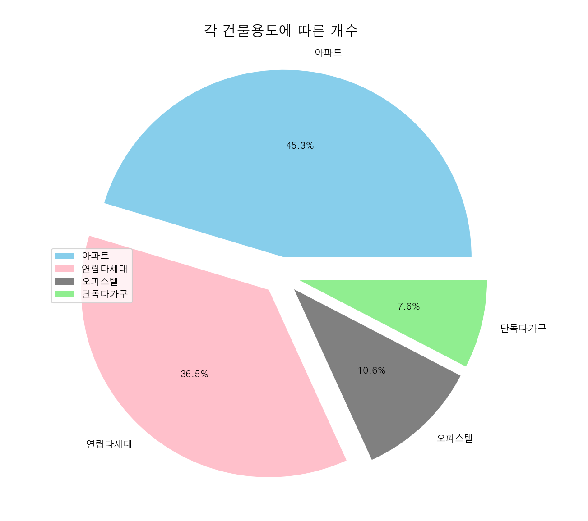
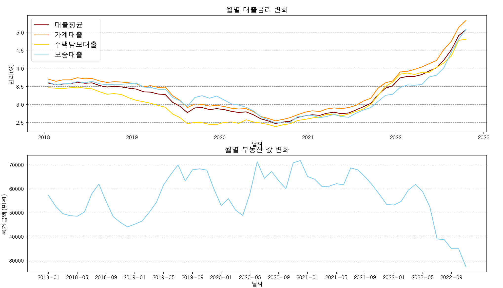

# Analysis of actual transaction price of housing prices in Seoul

 ◭ 2022.12  **OSS Term Project**  ◭
 
  
 
 ## **Introduction**
 
 현재 물가가 여러 요인에 인해 끊임없이 상승하여 이 물가 상승을 막아 시장이 얼어붙는 것을 막기 위해 각 나라들은 금리를 인상하였다.
 그러나 이러한 금리 인상으로 인해 가장 직접적으로 영향을 받아 부동산 또한 이에 맞추어 변화가 일어났다.
 부동산은 우리의 생활과 매우 가깝게 연관되어 있어 뉴스에서도 중요하게 다루는 주제 중 하나이다.
 그래서 최근에 서울 부동산 거래가 어디서, 얼마나, 어떻게 변화가 일어났는지 알아보고자 한다.  
 
 **matplotlib**, **seaborn** 등의 패키지를 사용하여 2018년~2022년까지 서울 부동산 거래 데이터와 대출금리 데이터를 **DataFlame**하여 기준을 나누어 데이터를 분석하고 시각화하여 최근에 어떤 변화가 나타났는지 알아보고자 합니다.
 
 ## **Developer**
 
 * 컴퓨터공학과 21100162 임민규

## **Release**

[통계청](https://kosis.kr/search/search.do?query=%EA%B8%88%EB%A6%AC)을 통해 2018-2022년 대출 금리 데이터(csv)를 얻었으며 [서울특별시 홈페이지 공공데이터](https://data.seoul.go.kr/dataList/OA-21275/S/1/datasetView.do)를 통해 2018-2022년 서울 부동산 실거래가 데이터(csv)를 얻었으므로 모든 저작권 규칙은 해당 사용 약관에 따릅니다.

* **pandas**로 csv 파일 불러와 데이터프레임 형태로 데이터 저장

  pandas 패키지로 csv 파일에서 불러온 데이터를 데이터프레임 형태로 저장하여 원하는 데이터만 불러오기에 매우 많은 도움이 되었습니다.

* **mataplotlib**, **seaborn**을 통해 세워둔 목적에 따른 그래프 설정
  (코드의 주석 섹션에서도 설명이 되어있습니다.)
  
  * 서울의 자치구별 건물면적 당 금액(만원) `막대그래프`

  * 서울의 자치구별 건물용도에 따른 금액(만원) `누적막대그래프`

  * 서울 전체의 각 건물용도의 퍼센트 `원 그래프`

  * 월별 대출금리의 변화 `꺾은선 그래프`

  * 월별 서울시 전체의 건물금액의 평균의 변화 `꺾은선 그래프`

* 그래프 기준 선정에 대한 설명
  
  그래프 기준 선정은 저자의 주관적인 기준으로 선정되었지만 주어진 데이터가 여러 형태의 그래프로 의미가 있도록 설정하였습니다.
  
## **Set Up & Prerequisites**

사용된 패키지: 

* [Pandas]([pandas - Data analysis with Python](https://pandas.pydata.org/)) For Data analysis
* [Matplotlib]([Matplotlib — Visualization with Python](https://matplotlib.org/)) For Visualization
* [Seaborn]([Seaborn - Data visualization with Python](https://seaborn.pydata.org/)) For visualization
* Data
   * [서울 부동산 실거래가 데이터]([서울 부동산 실거래가 데이터(csv)](https://data.seoul.go.kr/dataList/OA-21275/S/1/datasetView.do))
   * [예금은행 대출금리 데이터]([예금은행 대출금리 데이터(csv)](https://kosis.kr/search/search.do?query=%EA%B8%88%EB%A6%AC))
  
## **Results and Analyzation**
 
 * 서울 자치구별 건물면적 당 금액(만원)
   
   먼저 DataFrame 형태로 데이터를 정리하여 출력해보자
   
   {: width="122" height="238"}
 
   
  
  자치구별 건물면적 당 금액(만원) 그래프에서 상위 3위 안에는 강남구, 서초구, 용산구로 대체로 서울특별시 남부에 위치한 지역이 비싸고, 하위 3위로는 금천구, 도봉구, 강북구가 싼 것으로 
  분석되었다.  
  또한 서울과학기술대학교가 위치한 노원구는 대체로 건물면적 당 금액이 싼 편에 속한 것을 알게 되었다.
  
 * 서울 자치구별 건물용도에 따른 금액(만원)
  
   
   
   자치구별 건물용도에 따른 금액(만원) 그래프에서 각 자치구에서 대체로 **단독다가구**와 **아파트**가 비싸고 **연립다세대**와 **오피스텔**이 싼 것으로 분석되었다. 
    
   하지만 각 건물용도에 따른 개수가 위의 데이터 분석에 영향을 주기 때문에 이를 확인하기 위해 각 건물용도에 따른 개수에 대해 분석을 진행하였다.
 
 * 서울 각 건물용도에 따른 개수
 
   
   
   각 건물용도에 따른 개수 그래프를 통해서 **아파트**와 **연립다세대**가 서울 부동산 거래의 약 80% 이상을 차지하고 있다는 것을 알 수 있다. 
   또한 위 두 번째 그래프에서 분석한 결과와 합친다면 **단독다가구**는 서울 부동산 거래의 적은 양을 차지하고 있지만 다른 건물용도에 비해서 비싼 값을 차지하고 있다는 것을 알 수 있다. 
 
 * 월별 대출금리와 건물금액(부동산) 변화

   
   
   월별 대출금리와 건물금액 변화 그래프에서 2018-2022년까지의 데이터의 변화를 나타내었다. 
    
   이 그래프에서 대출금리와 건물금액과 대체로 반비례 관계로 변화한다는 것을 알 수 있으며, 현재 2022년 변화를 보면 계속해서 대출금리가 인상되는 것을 보아 향후에도 계속해서 인상될 것으로 예상되며 이에 따라 부동산 건물금액은 반대로 내려갈 것으로 예상됩니다. 
   
 
 

## **참고 문헌 & 참고 자료**

* Pandas DataFrame - ([Pandas DataFrame](https://wikidocs.net/4366))
* matplotlib를 이용한 데이터 시각화 - ([matplotlib를 이용한 데이터 시각화](https://wikidocs.net/2875))
